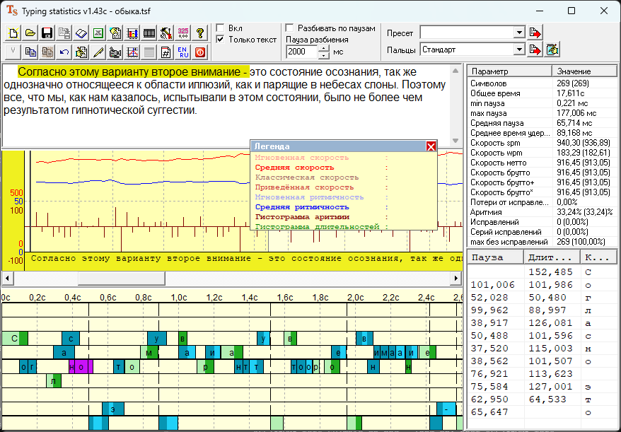
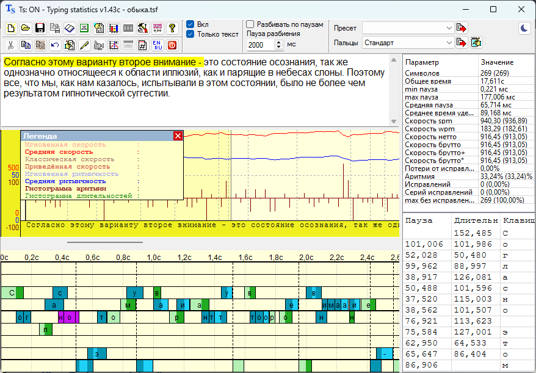

# Typing Statistics Remake

Кроссплатформенный ремейк **Typing statistics v1.43c** — анализатора клавиатурного набора Игоря В. Филимонова
(2008–2016).

Ремейк написан заново на C++ и Qt 6 и работает на **Windows, Linux (X11 и Wayland) и macOS (Intel и Apple Silicon)**.

Все старые файлы *.tsf и *.tsj полностью совместимы с данным ремейком. Каждая формула скорости набора сверена с оригиналом на реальных записях: тестовый стенд запускает оригинал,
  считывает всё, что он показывает, и сравнивает с ремейком бит в бит, включая особенности 80-битной арифметики
  оригинала.

На Apple Silicon 80-битной арифметики нет в процессоре, и ремейк воспроизводит её программно.

| Оригинал | Ремейк |
|---|---|
|  |  |

## Чем ремейк лучше оригинала

- **Кроссплатформенность.** Windows 10/11, Linux (X11 и Wayland — GNOME, KDE, sway, Hyprland), macOS 12+ на Intel
  и Apple Silicon.
- **Точное время нажатий.** Перехват клавиатуры работает в отдельном потоке: время нажатия засекается сразу, даже если
  программа в этот момент занята (пересчитывает большую запись, сохраняет файл). У оригинала нажатие ждало, пока
  программа освободится, а долгая работа (дольше секунды) приводила к тому, что Windows молча отключала перехват.
- **Улучшенная производительность.** Месячный журнал в полмиллиона нажатий открывается за доли секунды, прокрутка остаётся плавной
  (подробнее — ниже).
- **Чёткость на мониторах с масштабом (HiDPI).** 125–200 % и на Retina: интерфейс рисуется в полном разрешении, а не
  растягивается размытой картинкой.
- **Юникод.** Текст набора показывается как есть; оригинал выводил его через старый ANSI-редактор, и символы вне
  кодировки Windows-1251 заменялись.
- **Тёмная тема.** Переключается кнопкой в правом верхнем углу окна, сразу, без перезапуска.
- **Экспорт без Excel.** Файлы `.xlsx`/`.csv` пишутся самой программой; оригиналу нужен был установленный Excel.

Сознательно не перенесено: функция видео (AVI синхронизированное с клавограммой), функция «Запускать на одном ядре»

## Производительность

Проверялась на искусственной записи в **500 тысяч нажатий**.

- **Открыть такой файл** (один компьютер, один файл):

  | Запись | Ремейк | Оригинал |
  |---|---|---|
  | 100 тыс. нажатий | 0,12 с (окно готово через 1 с после запуска) | 0,53 с (1,8 с) |
  | 500 тыс. нажатий | 0,28 с (1,2 с) | 5,3 с (7,6 с) |

  Ремейк открывает месячный журнал в **~19 раз быстрее**. У оригинала время растёт быстрее размера записи: в пять раз
  больше нажатий — в десять раз дольше.
- **Нажатие клавиши** обрабатывается примерно за **5 микросекунд** (0,005 мс) — запись не мешает набору даже при
  огромном журнале.
- **Пересчёт** всего текста и статистики после набора — около 0,2 с на полмиллиона нажатий; на обычных записях
  (несколько тысяч нажатий) — единицы миллисекунд, то есть мгновенно.
- **Память**: около 70–95 МБ с открытой записью в полмиллиона нажатий.

Подробности замеров — в [re/perf.md](re/perf.md).

## Установка

- **Windows**: `TypingStatistics.exe` — один файл, установка не нужна.
- **Linux**: AppImage. При первом запуске программа попросит разрешение видеть нажатия клавиш: нажмите
  «Скопировать команду», вставьте её в терминал и введите пароль — это нужно один раз.
- **macOS**: `.dmg` (без нотаризации: при первом запуске — «Открыть» из контекстного меню). Нужно разрешение
  «Мониторинг ввода» в настройках конфиденциальности.

## Горячие клавиши

| Сочетание | Действие |
|---|---|
| держать F8, нажать F9 / держать F9, нажать F8 | включить / выключить запись |
| держать левый Ctrl, нажать левый Win | очистить запись |
| держать левый Ctrl, нажать правый Ctrl | вставить комментарий с временем и названием окна |
| держать левый Ctrl, нажать правый Shift | обнулить оперативную статистику |
| Ctrl+Alt+O | показать/спрятать оперативную статистику |

Сочетания работают в любом окне. В окне программы F4 открывает «Ввод текста» — набор в нём записывается.

## Сборка

Нужны Qt 6.8 (Core, Gui, Widgets, Test; LinguistTools для перевода), CMake и компилятор C++20.

```bash
cmake -S . -B build -G Ninja -DCMAKE_BUILD_TYPE=Release -DCMAKE_PREFIX_PATH=<путь к Qt>
cmake --build build
ctest --test-dir build
```

На Linux дополнительно нужны `xkbcommon` (и по возможности `xkbregistry`, `xkbcommon-x11`, `xcb-xkb`, Qt6::DBus) и
пакет приватных заголовков Qt (`qt6-base-private-dev` в Debian/Ubuntu). Сборка под все системы — в
[.github/workflows/ci.yml](.github/workflows/ci.yml), подробности о Linux и macOS — в
[re/crossplatform.md](re/crossplatform.md).

## Авторское право

Всё в программе — идея, интерфейс, формулы, тексты и оформление — принадлежит автору оригинала, Игорю В. Филимонову.
Ремейк может быть удалён по его просьбе.